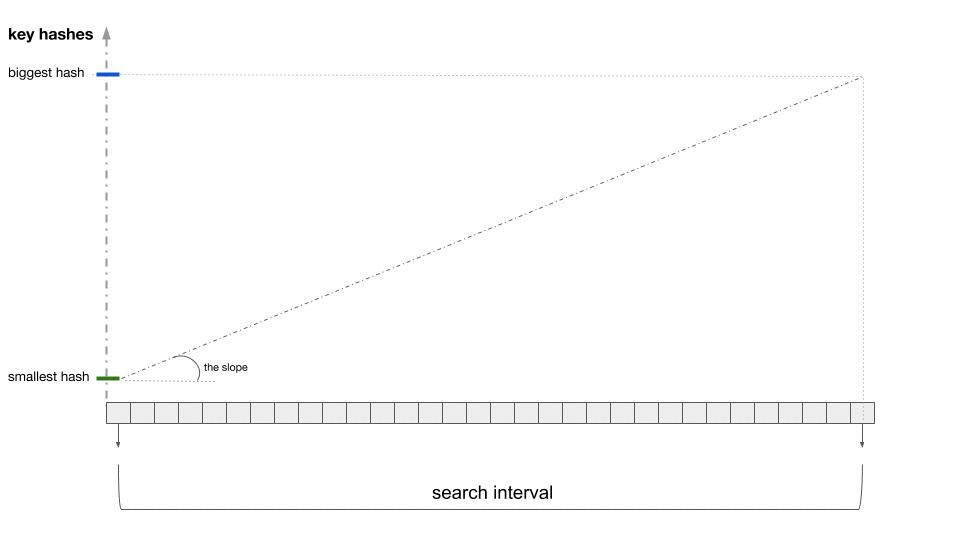

# Memtable:

The `Memtable` is an immutable associative data structure. It is `GC` friendly and memory efficient. 
It can replace the native `Go` map if there is no need to update or mutate the elements.

`Memtable` stores all the keys and their associated values in two arrays. It uses interpolation search 
to find a given key and return it's associated value. 

In this document, we will give an in-depth description of the `Memtable` design. We will start by 
describing what a naive implementation would look like. Then, we will identify the shortcomings of 
the naive design and address them one by one. Finally, we will present the current implementation.

## Naive implementation:

As stated above, let us start with a naive implementation. 

```go 
type MemtableNaive struct {
	keys         []uint64 // here the keys are uint64, but it can be any primitive type
	offsets      []uint32 // offsets has always one more element than `keys`.
	values       []byte
}
```

Indeed, The structure above is `GC` friendly. First, we only use 3 `heap` allocations. Consequently, 
the garbage collector only needs to track 3 pointers. In addition, we are only paying an extra `4 bytes` 
for each key in the data structure. 

In the structure above, we can find a `value` associated with a `key` using a linear search algorithm. 

```go 
func (m MemtableNaive) get(key string) (value []byte, ok bool) {
    for idx, k := range m.keys { 
        if k == key { 
            startIdx := m.offsets[idx]
            stopIdx := m.offsets[idx + 1]
            return m.data[startIdx:stopIdx], true
        }
    } 
    return nil, false
}
```

We can see that the algorithm above has an `O(n)` time complexity. We can do better! 

## Improvement 1: Using binary search to improve lookup time 

Let's keep the structure above and make one change. When we create the `Memtable`, we can sort the keys 
and keep them sorted at all time. Consequently, we can use binary search to find the `key`. 
Using this first improvement we can improve the time complexity of the get operation and achieve `O(log(n))`

## Improvement 2: Using interpolation search to improve the lookup

We want to improve our lookup time even further than what we can achieve with a `binary search` algorithm. In order 
to get even faster lookup times, we can rely on a algorithm called [interpolation search](https://www.geeksforgeeks.org/interpolation-search/). 

[interpolation search](https://www.geeksforgeeks.org/interpolation-search/) can achieve `O(log(log(n)))` time complexity 
for the lookup operation when we satisfy the following conditions : 

* The keys are numerical.
* We can store the keys in a sorted array.
* The keys follow a uniform distribution.


Let's see what changes we have to make to satisfy the requirements with the `Memtable`. First, we can hash 
any key into a `uin64` using a hash function. Second, we can sort those key hashes when we construct 
the `Memtable`. Last, if we use a cryptographic hash that distribution of the resulting keys will be uniform.


```go 
type Memtable struct {
	originalKeys []string // the original keys (here with string type)
	hashedKeys   []uint64 // a 64 bit hash of the originalKeys
	offsets      []uint32 // offsets has always one more element than `keys`.
	values       []byte
}
```

Now, when we receive a `key`, we hash it and we use [interpolation search](https://www.geeksforgeeks.org/interpolation-search/) on the `hashedKeys` field to retrieve the `index`. Once we have the index, we get the values back exactly like before.

### How interpolation search works : 



As you can see in the above illustration, the core of the algorithm works by providing approximate answers to the following questions: 

* **Question 1**: Given the smallest and the largest key in the `Memtable` and an arbitrary key that we want to find, can we provide a position estimate for the key ? 
* **Question 2**: Given the answers to **Question 1**, how can we narrow down the search region for the searched key ? 

Since we narrow down the search region at each step, if the key is in the `Memtable`. we will find it. 

### Interpolation search implementation: 

```go 
func (m Memtable) PositionEstimate(key uint64, low, high int) int { 
    // if we already know from somewhere else that the key is between `low` and `high` 
    // here is how we can produce and educated guess on where it could be.
	span := float64(len(m.keys))
	last := float64(m.keys[high])
	first := float64(m.keys[low])
    // Now that we have the slope, we have an estimate 
    // the tells us at what rate the keys are increasing
    slope := span / (last - first)
    nbSteps := slope * float64(key - m.keys[low])
    return lo + int(math.Min(float64(hi-lo-1), float64(nbSteps)))
}
```

Of course, the above estimate is noisy ( it's variance is high, we produced it with one sample!). 
However, it still good enough to drive our search. More specifically, is it good enough to help us narrow 
down the search region:

```go
func (m Memtable) SimplifiedInterpolatedSearch(key uint64) (position int, ok bool) {
    low := 0
    high := len(m.keys) -1
    for m.keys[low] < key { 
        candidateIndex := m.PositionEstimate(key, 0, len(m.keys) - 1)
        // In the following blog, we use the estimate to narrow down the search region.
        if m.keys[candidateIndex] < key {
            low = candidateIndex + 1 
        } else {
            high = candidateIndex
        }
    }
    if m.keys[low] != key {
		return nil, false
    }
    return low, true
}
```


### Optimisations: 
There are two optimisations that we make in the practical implementation : 

1. When `high` - `low` gets smaller than 64, we revert to a linear search algorithm.
2. We only compute the `slope` once at the start of the algorithm. It adds some iterations to the algorithms, but it makes each iteration way faster. As a result, the implementation is faster.

### Choosing a good hash function:

## Writing to and Reading from disk: 
TODO: write about how to serialize/deserialise the tructure

## Limitations: 

The are two main limitations that come with the design of the memtable. First, given that the `Get` operation has to do more work then with a traditionnal `map`. It will be up to an order of magnitude slower. Second, the structure is immutable and adding one element to it requires that we rebuild the whole structure.
